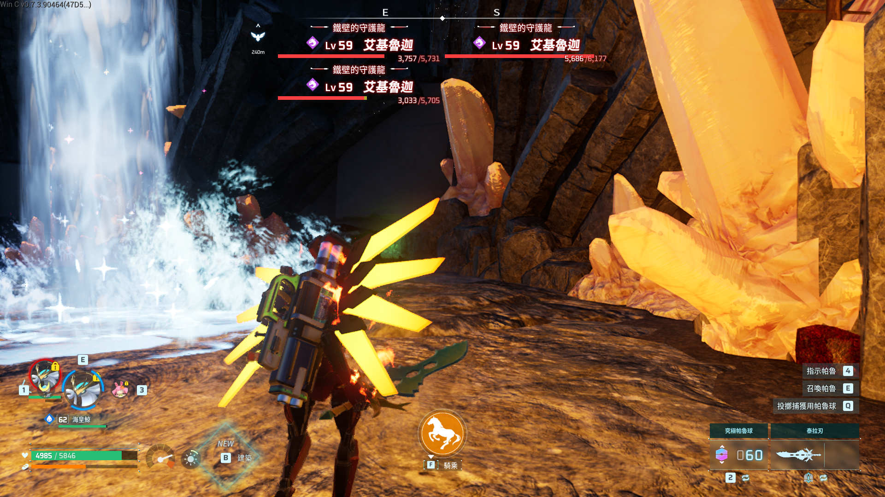

# Palworld MiniMap GUI

> 圖形化小地圖管理器 — 一鍵安裝、即開即用

給 Palworld 玩家和自架 dedi server 管理員的小地圖 MOD 管理工具。
自帶 GUI 介面，**雙擊 → 自動偵測路徑 → 自動備份 → 一鍵套用**，不用手動改 `Paks/`。

## 下載

| 檔案 | 大小 | 用途 |
|---|---|---|
| **[`MiniMap_GUI_Launcher.bat`](./MiniMap_GUI_Launcher.bat)** ⭐ | 834 B | **推薦下載這個** — 自解壓啟動器，自動解出完整 GUI |
| [`MiniMap_GUI.bat`](./MiniMap_GUI.bat) | 9.8 MB | 完整 self-extracting 安裝包（如果 Launcher 解碼失敗用這個） |
| [`Palworld-MiniMap-Uninstall.bat`](./Palworld-MiniMap-Uninstall.bat) | 11 KB | 卸載工具 |

## 使用方式

### 🖱️ 雙擊（最簡單）

1. 下載 `MiniMap_GUI_Launcher.bat`
2. 雙點執行
3. 視窗跳出來，選單跟著走就好

## 功能介紹

這包是 **Paldar MiniMap Radar + Okaetsu UE4SS** 的合包安裝器，提供 8 個關鍵元件 + 圖形化總管。

### 🎯 自動偵測（不用手動指定路徑）

- 讀 Steam registry（HKLM / HKCU / WOW6432Node 三處都掃）
- 讀 `libraryfolders.vdf`，**多 Steam 函式庫**自動跳轉（D:\SteamLibrary、E:\Steam...）
- 內建 fallback 路徑（C: / D: / E: 各種 Steam 變體）
- 自動判斷 `Binaries\Win64` 或 `Binaries\WinGDK`（Game Pass 版相容）

### 📦 一鍵部署 8 個元件

| 元件 | 位置 | 用途 |
|---|---|---|
| `UE4SS.dll` | `Win64\` | UE4SS 引擎，Lua 腳本運行環境 |
| `dwmapi.dll` | `Win64\` | Okaetsu 實驗性 hook |
| `UE4SS-settings.ini` | `Win64\` | UE4SS 配置 |
| `MemberVariableLayout.ini` | `Win64\` | UProperty 反射配置 |
| `mods.txt` | `Win64\Mods\` | 啟用 mod 清單 |
| `main.lua` | `Win64\Mods\BPModLoaderMod\Scripts\` | Paldar 進入點腳本 |
| `Paldar.pak` | `Content\Paks\LogicMods\` | 小地圖本體資源 |
| `Paldar.modconfig.json` | `Content\Paks\LogicMods\` | 小地圖配置 |

### 🎮 遊戲內熱鍵

安裝完進遊戲，按：

| 鍵 | 功能 |
|---|---|
| <kbd>H</kbd> | 切換小地圖顯示 / 隱藏 |
| <kbd>Z</kbd> | 超級放大（找寶可夢的時候用） |
| <kbd>L</kbd> | 切換小地圖位置（4 角落循環） |
| <kbd>K</kbd> | 自訂模式（調整大小 / 透明度） |

### 🛠️ GUI 內建工具

- **Install** — 一鍵安裝 8 個元件 + 自動備份舊 `Mods\`
- **Uninstall** — 完整還原，連 `Mods\.bak.YYYYMMDD_HHMMSS` 都不留
- **Refresh** — 重新掃描元件狀態（綠/橘/紅三色 pill 顯示）
- **📁 Win64** — 直接開 Win64 資料夾
- **📁 LogicMods** — 直接開 LogicMods 資料夾
- **📄 UE4SS.log** — 用記事本開 log（debug 必備）
- **🚀 Launch** — 一鍵拉 Steam 啟動 Palworld
- **Console 面板** — 即時顯示安裝/卸載 log

### 🔒 安全性

- 安裝前自動備份 `Mods\` → `Mods.bak.<時戳>`
- 安裝前自動關閉 Palworld / UE4SS process（避免檔案鎖定）
- 卸載前同樣關 process，確保乾淨移除
- 卸載 = 100% 還原，連 `dwmapi.dll` 都拔乾淨

### ⚙️ 進階

## 系統需求

- Windows 10 / 11
- PowerShell 5.1+（Win10 內建就有）
- 不需要管理員權限（除非遊戲裝在系統槽的受保護目錄）
- 大小：完整包約 10 MB

## 自動偵測的安裝位置

- 玩家端：`<Steam>\steamapps\common\Palworld\Pal\Content\Pal\Paks\`
- dedi server：`<Steam>\steamapps\common\PalServer\Pal\Content\Pal\Paks\`
- 多函式庫：讀 `config.vdf` / `libraryfolders.vdf`，跨磁碟也找得到

## 卸載

雙擊 `Palworld-MiniMap-Uninstall.bat`，會還原到安裝前的狀態。

## 安全性

- 所有修改前**自動備份**到 `backups/` 目錄
- 引擎本體檔（`Pal-WindowsNoEditor*.pak`）一律不動
- 不動 Steam Workshop cache（取消訂閱就會被引擎自動清掉）

## 問題回報

裝不起來、跑不動、想加新功能 → 開 Issue 或到我們 Discord 群找管理員。

## 版本

- v1.x — 圖形化重寫版（2026/07）
- v0.x — 命令列原型（已棄用）

---

Made for the Palworld community 🇹🇼